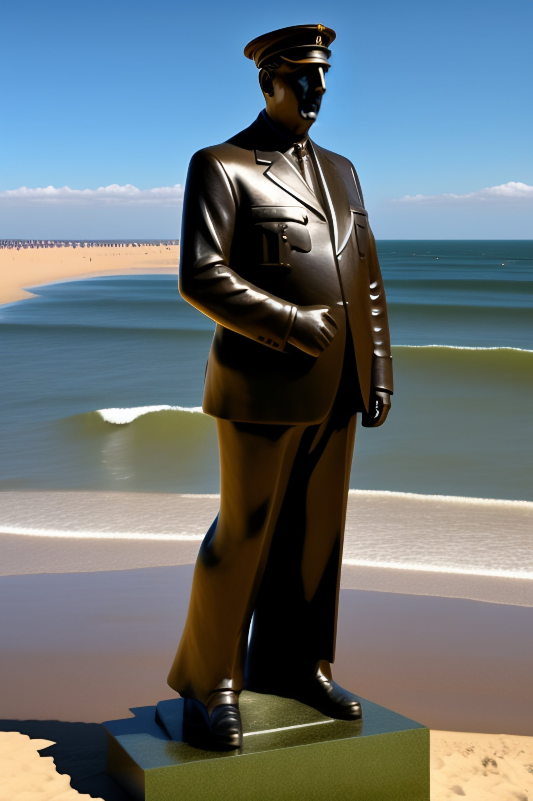

# prompting the past

*Short paper proposal for DH2024*. [Also available on Github](https://github.com/inactinique/DH2024_prompting_the_past/), with a repository that includes a code notebook.

For several years now, images generated by artificial intelligence systems such as [midjourney](), DALL-E or StableDiffusion, to give just a few examples, have become commonplace. Like text-generating systems such as GPT, LLAMA, BARD or BLOOM, they are based on interaction with users, which results in the writing of prompts. The aim of our current research is to examine the various means at our disposal for transforming not only generated images and texts but also prompts into primary sources for historians. This short paper will focus on prompts.

## litterature review

In the field of digital memory studies (@hoskinsDigitalMemoryStudies2018)

## harvesting data

<aside class="notes">

Just a few words about me:

I'm currently an assistant professor in european contemporary history at the Centre for Contemporary and Digital History (university of Luxembourg).

- I'm coming from international history but turned to digital humanities (depending on the definition you have of DH) and digital history;
- then started to study online commemoration and hence turned to digital memory studies;
- I particularly researched echoes of the Centenary of the Great War on Twitter and online commemoratins of the end of the second world war during the 2020 French and Italian lockdowns (in this case a reseach led with Deborah Paci for a book coordinated by Orli Fridman and Sarah Gensburger)

So I'm now in the field of digital memory studies -- while still being a historian as memory studies are a lot about litterary studies.

Here, i'm trying to wonder what we can do with new artefacts of the big data / AI era. It's a starting project, even only an idea yet. To be honest, I'm not even sure it's DH.

</aside>

# 

> [a french legionary, walking in a field, with black smoke of a fire in background](https://lexica.art/prompt/df06475d-3862-4fac-936e-86657566f524)

<aside class="notes">

You probably all have already seen that kind of images, generated by AI systems, here available through a search engine called [lexica.art](https://lexica.art). This search engine allows to find images generated by AI systems(mostly stable diffusion and their own engine, *Lexica Aperture* that I suppose is an optimized version of stable diffusion).

Lexica.art created this search engine by harvesting generated images published on the Discord Stable diffusion server. Ther's a 'semantic'-ish system associated to it (they speak of 'image relevancy'), as this image and its prompt were found through the keyword 'Napoléon'. 

There are many thing to say here:

- the helmet looks absolutely wrong, and really not French -- the spiked helmet evokes more something German, the form is somewhere between the Wermacht and Darth Vader.
- it doesn't look at all like a French legionary,

Historically it's just nonsense.

</aside>

## 

> [Chartist revolutionaries storming Westminster](https://lexica.art/prompt/c6d9d058-adf2-4a39-8652-6c5d2d0bf2a5)

<aside class="notes">

Well british history's not my specialty, but here again, there are some elements to say -- in fact, the impression of an infinite repetition of only one man is a strange way to represent a working class movement.

</aside>

## 

> [Nalanda University in 1300 AD](Nalanda University in 1300 AD)

<aside class="notes">

Here again, the image is puzzling. This one of a series of four, and this series mix different civilisations, including Mayas, China, Japan. But barely India but maybe on this one.

</aside>

## 

<aside class="notes">

Of course having a look at what ChatGPT -- here with GPT-4 as its engine, but believe me it's as bad as the GPT-3.5 version. Concepts are badly used, there are time inconcistencies (the use of 'Union européenne' in a pre-Maastricht treaty for instance. And there are mistakes: Jean Monnet did not have any influence on the Treaty of Rome, it's even uite far from his own coneption. 

And of course there are things strangely missing: Monnet as working in finance and adminsitration, it's true, but he started his career as a Cognac seller -- which is why he knew quite well the USA and could get there during WW2.

</aside>

## biases and primary sources

<aside class="notes">

WHy do I say all that, knowing that in the past few months, anyone reasonable enough (that excludes Elon Musl and Sam Altman) has made the same observations? Why would that be of interest to (digital) historians?

We can make two points here: 

1. there are on one side all the debate around ethics, embedded (western male white) biases in those systems. And more specifically, the training datasets that those AI-based systems have been trained on. 
  - training datasets can be seen as primary sources that embeds interpretations of the past, interpretations that are specific to the societies AI is developped in (Western). Which could imply that we should ask for their publication -- which in some cases is illusory as private firms won't publish their training dataset;
  - these training datasets can also be put into the context of concepts that have been used a lot -- probably too much -- lately (Hartog's presentism, Gumbrecht broad present or even Chakrabarthy's Anthropocene Time - that can make the link with time in AI and Kate Crawford's work)
    - Basically, if we take the example of GPT, as it is trained on a dataset that stopped in 2021, it is also embedding a fixed way of those society to see the world.

All this have been discussed and is currently discussed quite extensively.

2. There is a second point. 

- there are on the other side the data -- that can be also considered primary sources, born-digital primary sources -- that are generated by those systems. 

- those primary sources can be of several nature:
  - the metadata (who write which prompts when) -- with all the privacy and ethics issues we can imagine and that the Italian privacy institution has already pointed out. From the historian's point of view, it's primary sources in the making than ready-to-use sources and their accessibility is questionable;
  - the images and texts generated by AI-bases systems. Lot's of generated images are public -- with many controversial aspects in terms of, let's say, plagiarism. It's a bit more complicated with generated texts. Those primary sources in the making will be used to understand those embedded biases (and, for our concern, interpretations of the past) that are clearly present in those systems *via* the training datasets.
  - then, there are the prompts.
</aside>

# questionning the past

<small>« a portrait of Mr Bean as Napoléon Bonaparte »</small>

<aside class="notes">

Let's go back to those generated images and texts. If those images and texts are terrible, why are they still interesting?

- Questionning the past is one of the core activity of historians / and other humanists / social scientists working on the past;

- It's our basic epistemologic operation in the sense that we ask questions to start the process of elaborating new knowledge about the past.

The fact that tools (image or text generative systems), easy to use, are based on prompts -- which are often explicit or implicit questions.

Those systems are huge incentives to question the world around us, and the world that was. That should not let us indifferent.

At least does it not leave me indifferent, all the more that some of those prompts contain references to the past.

It's all the more interesting that those system could be defined as a-epistemological: when you use ChatGPT, for instance, there's no notion of truth, lie, knowledge in the way those systems are working.

</aside>

# prompts as open doors  to users' imagination about the past?

<small>« Napoleon bonaparte riding a shark »</small>

<aside class="notes">

So, as an historian, what interest me the most in LLMs or similar system, whether they generate images or texts, are not those systems, are not what they produce, but what is necessary to produce them: prompts -- of course when they evoke the post. The text that we need to enter to get images or texts -- images can also be entered, but let's stick for now to text --, that's a new kind of primary sources potentially linked to the past. 

- prompts can be seen as open doors to users' imagination about the past -- of course, it's much more complex than that, but nevertheless, we'll use this as a sort of hypothesis;
- So LLM or text-to-image system, if we follow this hypothesis, can be seen as not only text-to-image or text-to-text but also as system that, as an aside, are generating primary sources on collective memory.

Napoléon is a good example of what could be studies:

- First, let's be clear, in those prompts history often means war;
- Because Napoléon is linked to episodes and concepts that are some of the basis of European history
  - empire / slavery
- Because even within Europe, ways to consider this part of French and European history is definitly diverse (something French citizens do usually not understand -- in Spain, Napoleon's massacre are almost as traumatic as the Spanish civil war)

</aside>

# a corpus of prompts about the past

<small>« prompting the past »*</small>

<aside class="notes">

My problem here is that it's not that easy to get a balanced corpus of prompts. I'm working on that, and can for now name only a few leads.

Of course, all ethics and privacy issues are still to be managed.

- contacting AI-systems developers and firms
  - craiyon: did not keep time-date informations up to now;
  - no way openAI is accepting -- and not sure I want to work with them;
  - Stable Diffusion
  - For midjourney, I need to investigate more, but can only be done with a paid subscription and not sure gives the right to 
- prompts search engines (lexica.art, PromptHero, craiyon, etc.)
  - limitation : date time informations
- Discord servers
  - It's how search engines built their corpus => there could be enough information.
- reddit
  - I don't know if it's a good tool / but easy to scrap data there
- Twitter 
  - hashtags where people just tweet prompts + image.
  - Elon Musk's problem: might not be possible nor pertinent.

That's for the source. The second point is, well, what do we mean by 'past'?

So I do not have this corpus yet, but started experiments. And reading those « experiments ».

</aside> 

# reading prompts

<small>« what is digital history? an abstract painting by Vassily Kandisky »*</small>

<aside class="notes">

Up to now, I did not really speak about digital humanities and history or digital history, though shaping the corpus might mobilize DH-related techniques or at least digital methods (scrapping, API uses, etc).

From the few elements I could get yet, of course there are some things that we can already do. A colleague of mine developped a small scrapping script and we could harvest some prompts. I've used my usual tools [IRaMuTeQ](https://iramuteq.org).

</aside>

## distant reading prompts 

<aside class="notes">

Here's a sort of topic modelling (not topic modelling but the assumes same function) of a corpus of 1908 prompts.

Iramuteq is basically clustering prompts based on collocations of words. The keywords you see are words that are the most representative of those clusters and allow for an interpretation of the clusters. There are other, thanks to this software, ways to help the user interpret the clustering (getting the most representative prompts of each clusters for instance).

The prompts here are containing 'european union' - I wanted other keywords for this presentation, but the scripts is not working anymore so I could not collect data specifically for this presentation.

- it's not only about the past, but quite a lot about
- there are clusters about styles -- note that a lot are 'historical' (soviet propaganda)
- there are elements of recent politics (nigel farage / marine) 
- europe as something linked to a period of time: Middel Age (heraldic) / 17th Century (Rembrandt)
- notions quite linked to european history: 'empire'
- the question of the link with news is quite important
- war is very present => because Europe, but it seems that there is a global association of history and war

</aside>

# who's prompting, users or machines?

<small>« who’s prompting, users or machines? »*</small>

<aside class="notes">

My hypothesis was that prompts are a door to people's imagination about the past. It' now that I will comment and criticize this hypothesis.

Discussing this hypothesis is also switching from DH methods to digital sociology methods: mixing data  with qualitative analysis, interviews, etc.

If we stick to distant reading of prompts, we do not have the whole picture, and are missing what's happening between the users and the interface.

</aside>

## 

> [joe biden doing a nazi salute, in front of brandenburger tor. huge nazi crowd in front of him. face of joe biden is clearly visible. canon eos r 3, f / 1. 4, iso 1 6 0 0, 1 / 8 0 s, 8 k, raw, grainy ](https://lexica.art/?q=history&prompt=486249a4-4f50-46c8-9163-d7430c2b46db)

<aside class="notes">

- the aim here of the user was to get a nazi salute -- and it's not working
  - think about the 'Napoléon rides a shark' image that you saw before: it's the same, it doesn't work
- It's not working for different reasons:
  - well, this system does not know what a nazi salute is -- images here are just pixels which succession is statistically pertinent
  - there might be limitations implemented in the text-to-image system (not likely with stable diffusion)

What does a user who did not get the results it wanted? 

- as it fails, users might have strategies to get what they want
  - strategy based on changing prompts, 
  - means that prompts, not only images (or generated text), are the result of the settings of the machine, or at least partly, and of a man-machine interaction.

</aside>

## should we create our own prompt-generating-systems?

<small>« digital history »*</small>

<aside class="notes">

- we need prompts with proper metadata and that relate to the past 
    - one of the way to get that is to set up our own image / text generation system. With open source systems, it could be posisble.
    - we could train thoss system on 'historical data'.
    - many problems to solve -- including, of course ethics.

- we need to do scalable reading
   - but also to mix methods, not only DH but also (digital) sociology: interviews and surveys.

Here again, might cause ethical problems.

</aside>

# 

> Charles De Gaulle bronze sur une plage de Normandie*

<aside class="notes">

And as a conclusion:

This prompt means "Charles De Gaulle sunbathes on a beach in Normandy". But 'bronze' means also 'bronze' - a metal used to build statues. Of course many details are wrong, starting with the hat, but it's not the point here.

Here, the memory context (ie embedded into the training dataset) was stronger than the meaning the user -- say, me -- put in the prompt.

</aside>